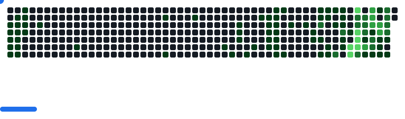

<h1 align="center">Hippolyte</h1>

  
  
  

**Full-Stack & QA Automation Engineer — 8+ years.**

I build products end-to-end and the test infrastructure that keeps them shipping: Selenium/Appium frameworks that cut regression time by **65%**, CI/CD pipelines, and AI-assisted tooling. I sit where dev meets QA.

---

### Tech stack

**Core**

**Test automation**

**DevOps**

**AI & LLM**

RAG pipelines, agent workflows and MCP servers — plus the LLM fundamentals behind them (context windows, tool use, prompt design).

---

### Currently

- Building AI-assisted QA tooling on top of MCP and the Claude API
- Open to freelance & consulting on test automation and CI/CD

---

### GitHub

  
  

<picture>
  <source media="(prefers-color-scheme: dark)" srcset="./images/breakout-dark.svg" />
  <source media="(prefers-color-scheme: light)" srcset="./images/breakout-light.svg" />
  
</picture>
